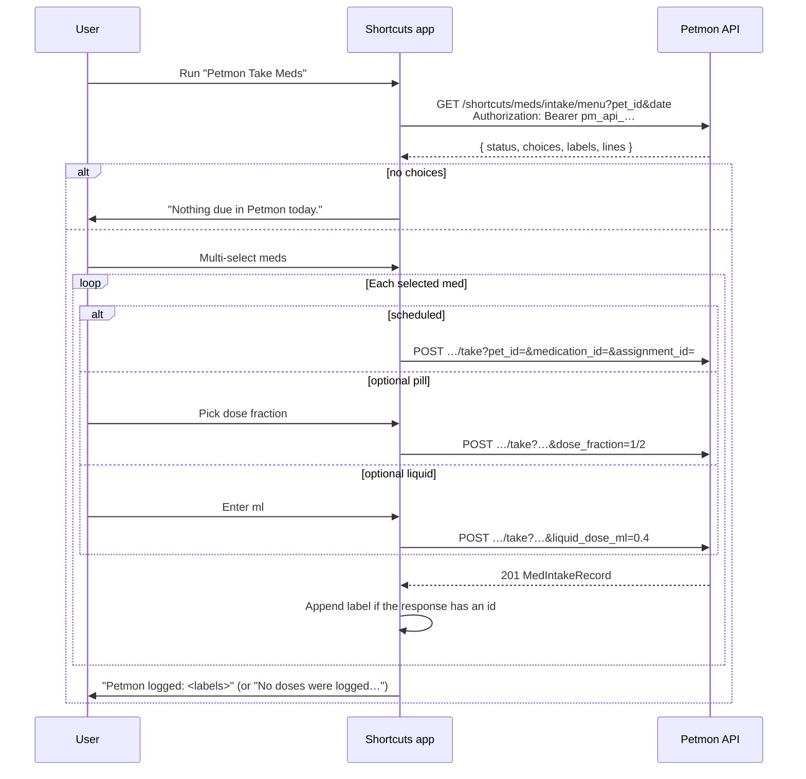

# Apple Shortcut — med intake

Petmon ships a signed **Petmon Take Meds** shortcut for logging daily medications from an iPhone. The shortcut asks for server URL, pet id, and API key on first import, then fetches today's menu and records takes via the shortcuts API.

Source: [`shortcuts/med-intake.cherri`](../shortcuts/med-intake.cherri), compiled with [Cherri v2.3.0](https://cherrilang.org).

See also: [API endpoints](#api-endpoints) · [Server logic](#server-logic) · [Shortcut workflow](#shortcut-workflow-on-device) · [Build](#build) · [Publish](#publish-to-icloud-iphone-import)

## Overview



**Distribution:** iPhone import uses an **iCloud share link** (configured in `assets/shortcuts/publish.json` or `MED_INTAKE_SHORTCUT_ICLOUD_URL`). The Health page **Apple Shortcut** button (visible on iOS only) reads `GET /api/v1/info` → `med_intake_shortcut_icloud_url`.

**Out of scope (for now):** bundle members, choosing a dose for a *scheduled* med (the assignment fixes it), and backdating. The take endpoint is real-time only.

## Why Cherri

The workflow was hand-written as a plist generator first. Shortcuts imports a malformed plist without complaint and then does the wrong thing silently, which cost three shipped-but-broken releases:

| Symptom | Cause |
|---|---|
| Nothing logged, no error | A bare `Repeat Item` reference inside nested loops resolved to the *inner* loop |
| Menu always empty | `Format Date` had no input, so the request asked for `&date=` |
| "Please choose a value for each parameter" | Required action parameters we had no way to know about |

Cherri is a compiler with an action database (`cherri --action=<name>`, `cherri --docs=<category>`), so parameters and their forms come from the compiler rather than guesswork, and loops bind names instead of magic variables.

## Server logic

Implementation: `src/services/shortcut_menu.rs`, handlers in `src/api/shortcuts.rs`.

### Menu (`GET /shortcuts/meds/intake/menu`)

1. Load daily assignments for `pet_id` + `date` (same data as `/health/meds/assignments/daily`).
2. **Include** scheduled meds that still have remaining takes for `date`, and **optional** (as-needed) meds active on `date`. A scheduled med disappears once its daily dose count is fully recorded.
3. **Exclude** medications that appear in any bundle for the pet.
4. For each row, build a display label: `{medication name} · {dose_label}`, then **disambiguate duplicates** by appending ` (2)`, ` (3)`, …
5. Return `status`, `choices`, `labels`, and `lines`.

```json
{
  "status": "ok",
  "choices": [
    {
      "label": "Benazepril · 1 tab",
      "medication_id": "abc123…",
      "assignment_id": "def456…",
      "kind": "scheduled"
    },
    {
      "label": "Gabapentin · As needed",
      "medication_id": "ghi789…",
      "assignment_id": "jkl012…",
      "kind": "optional_pill",
      "fractions": ["whole", "three_quarter", "half", "third", "quarter", "eighth", "sixteenth"],
      "fraction_labels": ["1", "3/4", "1/2", "1/3", "1/4", "1/8", "1/16"]
    }
  ],
  "labels": ["Benazepril · 1 tab", "Gabapentin · As needed"],
  "lines": ["Benazepril · 1 tab|def456…|scheduled", "Gabapentin · As needed|jkl012…|optional_pill|1,3/4,…"]
}
```

`labels` are **unique** — the picker carries a label out of the multi-select and the shortcut finds its `choices` entry by string equality. Two identical labels would log two doses from one tap.

### Take (`POST /shortcuts/meds/intake/take`)

Records a real-time dose. Auth: `api_write` (same `pm_api_…` bearer token as the menu).

Required query params: `pet_id`, `medication_id`, `assignment_id`.

| Kind | Additional params |
|------|-------------------|
| `scheduled` | none |
| `optional_pill` | `?dose_fraction=1/2` (or `half`) |
| `optional_liquid` | `?liquid_dose_ml=0.4` |

**Timing: none.** This endpoint is real-time only. It takes no `occurred_at` / `local_date` — the server stamps its own local time. Use the web UI or `POST /health/meds/intake` for backdated entries.

Unknown query params are **rejected** with `400` (`MedIntakeTakeQuery` is `deny_unknown_fields`), so a drifted client fails loudly rather than silently dropping a timestamp.

The device's calendar day still matters for the *menu* (`?date=`), filled from the phone's clock. If phone and server are on different days, the due-date re-validation rejects the take with `400` rather than filing the dose on the wrong day.

### Shortcut file download

`GET /shortcuts/meds/intake.shortcut` serves the embedded signed binary. **Public** — no auth required.

## Shortcut workflow (on device)

| Step | Action |
|------|--------|
| Import questions | Server URL, pet UUID, API key (Write scope) |
| 1 | Three Text actions hold the answers |
| 2 | Current date → `yyyy-MM-dd` (the phone's own day) |
| 3 | `GET {server}/api/v1/shortcuts/meds/intake/menu?…` |
| 4 | Read `choices`; if empty, show "Nothing due in Petmon today." and stop |
| 5 | Multi-select from `labels`: "Select meds to log" |
| 6 | For each chosen label, loop `choices` and compare `label` with the selected label |
| 6a | `scheduled` → `POST …/take?pet_id=…&medication_id=…&assignment_id=…` |
| 6b | `optional_pill` → choose from `fraction_labels` → `POST …?…&dose_fraction=…` |
| 6c | `optional_liquid` → ask ml → `POST …?…&liquid_dose_ml=…` |
| 7 | Append the label to `logged` **only if the response contains an `id`** |
| 8 | Show `logged` — or "No doses were logged…" when it is empty |

Step 7 is deliberate: Shortcuts hands a 4xx body to the next action instead of stopping the run, so an unchecked POST would let a failed take report itself as logged.

## Cherri notes

Hard-won specifics for **v2.3.0**, encoded as comments in the source:

- **`const` for anything an action consumes; `@` for mutable accumulators.** `const` compiles to `Type: ActionOutput` carrying the producing action's UUID. `@name` compiles to a by-name `Type: Variable`, only sound for something a `Set Variable` or loop actually defines.
- **`@` is required on all mutable variable references** (enforced since v2.2.0). `const` references are bare.
- **Loop variables are mutable** — capture them via `"{@var}"` before conditions. `getValue` results need `.text` coercion in conditions: `if label.text == pickText`.
- **`#define` must precede `#include`.**
- **`#include 'actions/scripting'` is not needed** — scripting actions are auto-included in v2.3.0.
- **Import questions** cannot be used as variable values and each fills exactly one action argument, so each one feeds its own `text(question )` action. The space before `)` is load-bearing.
- **Error positions can be stale**; bisect the file rather than trusting them.
- **No `else if`** — use consecutive `if`s.

`shortcuts/build.py` re-points each import question's `ActionIndex` at the Text action producing its constant (v2.3.0 omits the field; the script adds it) and verifies that every variable reference resolves.

## Build

Install the compiler first (v2+ cannot be installed via `go install`):

```bash
make install-cherri     # downloads Cherri v2.3.0 to ~/.local/bin/cherri
```

```bash
make check-shortcut     # compile + verify (no macOS, no server) — part of `make check` and CI
make build-shortcut     # compile + verify + sign (macOS)
```

`shortcuts/build.py` does three things: compiles, corrects the import-question wiring, and verifies that every variable reference resolves — a dangling reference leaves a parameter silently empty at run time.

| File | Purpose |
|------|---------|
| `shortcuts/med-intake.cherri` | The workflow source |
| `shortcuts/build.py` | Compile → patch → verify → sign |
| `shortcuts/publish.py` | Record the iCloud link in `publish.json` |
| `assets/shortcuts/Petmon Take Meds.shortcut` | Signed binary **committed to git** (embedded in the Docker image) |

Two macOS quirks: `shortcuts sign` requires the input file to be named `*.shortcut`, and it accepts the XML plist Cherri emits — no `plutil -convert binary1` step.

## Publish to iCloud (iPhone import)

iOS **does not** import self-hosted `.shortcut` URLs. Use an **iCloud share link**.

```bash
make shortcut     # build, sign, open Shortcuts, prompt for the link
```

Or step by step:

```bash
make build-shortcut
# Shortcuts app → open Petmon Take Meds → Share → Share Link, then:
python3 shortcuts/publish.py --set-url 'https://www.icloud.com/shortcuts/XXXXXXXX'
git add assets/shortcuts/publish.json assets/shortcuts/"Petmon Take Meds.shortcut"
git commit -m "chore: update med intake shortcut"
```

Redeploy so `GET /api/v1/info` returns the new URL.

### Config

| Source | Precedence |
|--------|------------|
| `MED_INTAKE_SHORTCUT_ICLOUD_URL` env | Highest |
| `assets/shortcuts/publish.json` → `icloud_url` | Committed default |

## API endpoints

| Method | Path | Auth | Purpose |
|--------|------|------|---------|
| `GET` | `/api/v1/shortcuts/meds/intake/menu?pet_id=&date=` | `api_read` | Menu (`status` + `choices` + `labels` + `lines`) |
| `POST` | `/api/v1/shortcuts/meds/intake/take?pet_id=&medication_id=&assignment_id=` | `api_write` | Record take |
| `GET` | `/api/v1/shortcuts/meds/intake.shortcut` | none | Signed shortcut file |
| `GET` | `/api/v1/info` | none | Includes `med_intake_shortcut_icloud_url` when set |

OpenAPI: `/api/docs` → **Shortcuts** tag.

## Updating shortcut logic

1. Edit `shortcuts/med-intake.cherri`.
2. `make check-shortcut` — compiles and verifies the plist.
3. `make build-shortcut` on a Mac, import the file, run it end to end.
4. Commit the new `assets/shortcuts/Petmon Take Meds.shortcut`.
5. `make shortcut` to share a new iCloud link and record it with `--set-url`.
