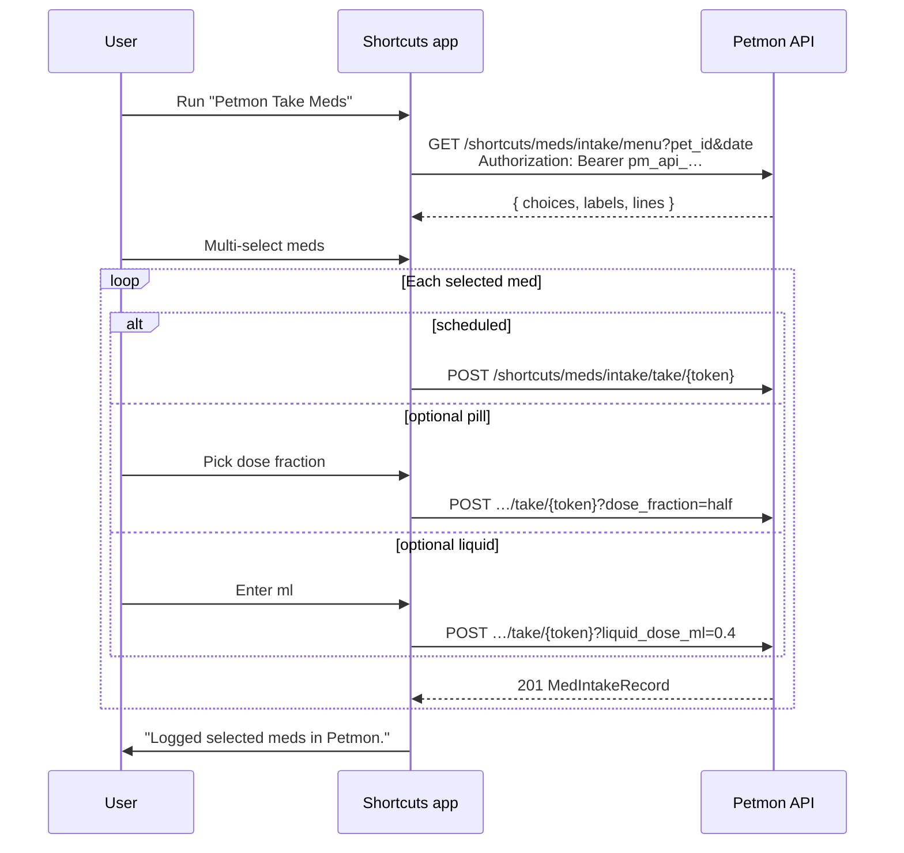

# Apple Shortcut — med intake

Petmon ships a signed **Petmon Take Meds** shortcut for logging daily medications from an iPhone. The shortcut asks for server URL, pet id, and API key on first import, then fetches today’s menu and records takes via the shortcuts API.

See also: [API endpoints](#api-endpoints) · [Server logic](#server-logic) · [Shortcut workflow](#shortcut-workflow-on-device) · [Build & publish](#build-macos)

## Overview



**Distribution:** iPhone import uses an **iCloud share link** (configured in `assets/shortcuts/publish.json` or `MED_INTAKE_SHORTCUT_ICLOUD_URL`). The Health page **Apple Shortcut** button reads `GET /api/v1/info` → `med_intake_shortcut_icloud_url`. Desktop falls back to downloading the signed file from the server.

Android users: see [`docs/automate-med-intake.md`](automate-med-intake.md) (AutoMate `.flo` download or Community link).

**Out of scope (for now):** bundle members, backdated takes, custom dose overrides on scheduled meds.

## Server logic

Implementation: `src/services/shortcut_menu.rs`, handlers in `src/api/shortcuts.rs`.

### Menu (`GET /shortcuts/meds/intake/menu`)

1. Load daily assignments for `pet_id` + `date` (same data as `/health/meds/assignments/daily`).
2. **Include** scheduled meds due on `date` and **optional** (as-needed) meds active on `date`.
3. **Exclude** medications that appear in any bundle for the pet.
4. For each row, build a display label: `{medication name} · {dose_label}`.
5. Encode a **take token** (see below) and return:

```json
{
  "choices": [
    {
      "label": "Benazepril · 1 tab",
      "token": "eyJw…",
      "kind": "scheduled"
    },
    {
      "label": "Gabapentin · As needed",
      "token": "eyJw…",
      "kind": "optional_pill",
      "fractions": ["whole", "three_quarter", "half", "third", "quarter", "eighth", "sixteenth"]
    }
  ],
  "labels": [
    "Benazepril · 1 tab",
    "Gabapentin · As needed"
  ],
  "lines": [
    "Benazepril · 1 tab|eyJw…|scheduled",
    "Gabapentin · As needed|eyJw…|optional_pill|whole,three_quarter,half,third,quarter,eighth,sixteenth"
  ]
}
```

The shortcut picker uses `labels`; after selection it matches each chosen label to the parallel `lines` entry, splits on `|`, and reads token, kind, and optional fraction list.

### Take tokens

Opaque URL-safe base64 tokens (no server-side storage). Payload (JSON before encoding):

| Field | Description |
|-------|-------------|
| `pet_id` | UUID string |
| `medication_id` | Medication id |
| `assignment_id` | Assignment id |
| `exp` | Unix expiry (issued at menu fetch + **24 hours**) |

### Take (`POST /shortcuts/meds/intake/take/{token}`)

Decodes the token, rejects expired/invalid tokens, and calls the same intake path as the web UI (`medication_service::create_intake`) with `source_type: "shortcut"`, `taken: true`, and server-stamped time.

| Kind | Body / query |
|------|----------------|
| `scheduled` | none |
| `optional_pill` | `?dose_fraction=half` or JSON `{ "dose_fraction_override": "half" }` |
| `optional_liquid` | `?liquid_dose_ml=0.4` or JSON `{ "liquid_dose_ml_override": 0.4 }` |

Auth: menu requires `api_read`; take requires `api_write` (Bearer API token in the shortcut).

### Shortcut file download

`GET /shortcuts/meds/intake.shortcut` serves the embedded signed binary. **Public** — no auth.

## Shortcut workflow (on device)

Generated by `scripts/build-med-intake-shortcut.py` → `build_workflow()`.

| Step | Action |
|------|--------|
| Import questions | Server URL, pet UUID, API key (Write scope) |
| 1 | Read configured Server URL, Pet ID, API Key |
| 2 | Current date → format `yyyy-MM-dd` |
| 3 | `GET {server}/api/v1/shortcuts/meds/intake/menu?…` |
| 4 | Parse JSON `labels` and `lines` arrays |
| 5 | Multi-select from `labels`: "Select meds to log" |
| 6 | For each chosen label, find the matching `lines` row, split `\|`, branch on `kind` |
| 6a | `scheduled` → `POST …/take/{token}` |
| 6b | `optional_pill` → choose fraction from csv → `POST …/take/{token}?dose_fraction=…` |
| 6c | `optional_liquid` → ask ml → `POST …/take/{token}?liquid_dose_ml=…` |
| 7 | Show result |

After workflow changes: rebuild on macOS, commit `.shortcut`, republish iCloud, update `publish.json`.

## API endpoints

| Method | Path | Auth | Purpose |
|--------|------|------|---------|
| `GET` | `/api/v1/shortcuts/meds/intake/menu?pet_id=&date=` | `api_read` | Menu (`choices` + `labels` + `lines`) |
| `POST` | `/api/v1/shortcuts/meds/intake/take/{token}` | `api_write` | Record take |
| `GET` | `/api/v1/shortcuts/meds/intake.shortcut` | none | Signed shortcut file |
| `GET` | `/api/v1/info` | none | Includes `med_intake_shortcut_icloud_url` when set |

OpenAPI: `/api/docs` → **Shortcuts** tag.

## Build (macOS)

Requires macOS with the Shortcuts CLI (`shortcuts sign`) and Python 3.

```bash
make build-med-intake-shortcut
# or: python3 scripts/build-med-intake-shortcut.py
```

Outputs:

| File | Purpose |
|------|---------|
| `assets/shortcuts/Petmon Take Meds.unsigned.plist` | Generated workflow (gitignored) |
| `assets/shortcuts/Petmon Take Meds.shortcut` | Signed binary **committed to git** (embedded in the Docker image) |

Linux CI skips signing; the committed signed file from a Mac is used.

## Publish to iCloud (iPhone import)

iOS **does not** import self-hosted `.shortcut` URLs via `shortcuts://import-shortcut`. Use an **iCloud share link** instead.

```bash
make shortcut
```

Builds/signs the shortcut, opens it in Shortcuts, then prompts for the iCloud share URL and writes `assets/shortcuts/publish.json`.

Or step by step:

```bash
make publish-med-intake-shortcut
```

After Shortcuts → Share → Share Link:

```bash
python3 scripts/publish-med-intake-shortcut.py --set-url 'https://www.icloud.com/shortcuts/XXXXXXXX'
git add assets/shortcuts/publish.json
git commit -m "chore: update med intake shortcut iCloud link"
```

Redeploy so `GET /api/v1/info` returns the new URL.

### Config

| Source | Precedence |
|--------|------------|
| `MED_INTAKE_SHORTCUT_ICLOUD_URL` env | Highest |
| `assets/shortcuts/publish.json` → `icloud_url` | Committed default |

## Updating shortcut logic

1. Edit `scripts/build-med-intake-shortcut.py` (`build_workflow()`).
2. `make shortcut` on a Mac and commit the new `Petmon Take Meds.shortcut`.
3. `make publish-med-intake-shortcut` and update `publish.json` with a **new** iCloud link.
