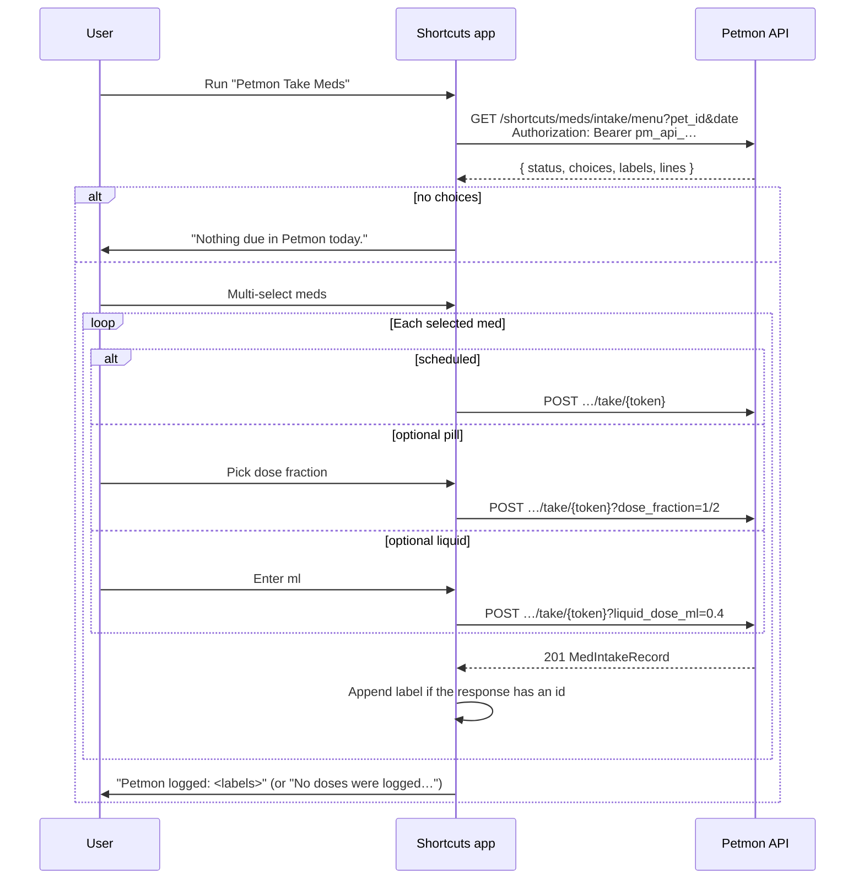

# Apple Shortcut — med intake

Petmon ships a signed **Petmon Take Meds** shortcut for logging daily medications from an iPhone. The shortcut asks for server URL, pet id, and API key on first import, then fetches today’s menu and records takes via the shortcuts API.

Source: [`shortcuts/med-intake.cherri`](../shortcuts/med-intake.cherri), compiled with [Cherri](https://cherrilang.org).

See also: [API endpoints](#api-endpoints) · [Server logic](#server-logic) · [Shortcut workflow](#shortcut-workflow-on-device) · [Build](#build) · [Publish](#publish-to-icloud-iphone-import)

## Overview



**Distribution:** iPhone import uses an **iCloud share link** (configured in `assets/shortcuts/publish.json` or `MED_INTAKE_SHORTCUT_ICLOUD_URL`). The Health page **Apple Shortcut** button reads `GET /api/v1/info` → `med_intake_shortcut_icloud_url`. Desktop falls back to downloading the signed file from the server.

Android users: see [`docs/automate-med-intake.md`](automate-med-intake.md) (AutoMate `.flo` download or Community link).

**Out of scope (for now):** bundle members, choosing a dose for a *scheduled* med (the assignment fixes it), and backdating. The take endpoint is real-time only.

## Why Cherri

The workflow was hand-written as a plist generator first. Shortcuts imports a malformed plist without complaint and then does the wrong thing silently, which cost three shipped-but-broken releases:

| Symptom | Cause |
|---|---|
| Nothing logged, no error | A bare `Repeat Item` reference inside nested loops resolved to the *inner* loop |
| Menu always empty | `Format Date` had no input, so the request asked for `&date=` |
| "Please choose a value for each parameter" | Required action parameters we had no way to know about |

Cherri is a compiler with an action database (`cherri --action=<name>`, `cherri --docs=<category>`), so parameters and their forms come from the compiler rather than from guesswork, and loops bind names instead of magic variables. It emits a `.shortcut` file, so distribution — signed file, iCloud link, the Health-page button — is unchanged.

## Server logic

Implementation: `src/services/shortcut_menu.rs`, handlers in `src/api/shortcuts.rs`.

### Menu (`GET /shortcuts/meds/intake/menu`)

1. Load daily assignments for `pet_id` + `date` (same data as `/health/meds/assignments/daily`).
2. **Include** scheduled meds due on `date` and **optional** (as-needed) meds active on `date`.
3. **Exclude** medications that appear in any bundle for the pet.
4. For each row, build a display label: `{medication name} · {dose_label}`, then **disambiguate duplicates** by appending ` (2)`, ` (3)`, …
5. Encode a **take token** (see below) and return `status`, `choices`, `labels`, and `lines`.

```json
{
  "status": "ok",
  "choices": [
    { "label": "Benazepril · 1 tab", "token": "eyJw…", "kind": "scheduled" },
    {
      "label": "Gabapentin · As needed",
      "token": "eyJw…",
      "kind": "optional_pill",
      "fractions": ["whole", "three_quarter", "half", "third", "quarter", "eighth", "sixteenth"],
      "fraction_labels": ["1", "3/4", "1/2", "1/3", "1/4", "1/8", "1/16"]
    }
  ],
  "labels": ["Benazepril · 1 tab", "Gabapentin · As needed"],
  "lines": ["Benazepril · 1 tab|eyJw…|scheduled", "Gabapentin · As needed|eyJw…|optional_pill|1,3/4,…"]
}
```

The Cherri shortcut reads `choices` directly — it can index dictionaries, so it needs neither `lines` nor `status`. Both stay in the response for the **AutoMate** (Android) flow, which cannot:

| Contract | Why it exists |
|----------|---------------|
| `status` is `"ok"` or `"empty"` | AutoMate cannot count a list, so “nothing due today” has to be a value it can compare. |
| `labels` are **unique** | A flow carries a label out of the picker and finds its entry by string equality. Two identical labels would log two doses from one tap. |
| `lines` — pipe-encoded, field 4 = `fraction_labels` | AutoMate splits strings; it cannot walk an array of objects. |

### Take tokens

URL-safe base64 JSON, with no server-side storage.

| Field | Description |
|-------|-------------|
| `pet_id` | UUID string |
| `medication_id` | Medication id |
| `assignment_id` | Assignment id |
| `exp` | Unix expiry (issued at menu fetch + **24 hours**) |

The token is **not signed or encrypted** — treat it as a convenience handle, not an authorization. Every take still needs an `api_write` bearer token, and `repo::med_intake_records::create` re-validates that the medication belongs to the pet, that the assignment belongs to the medication, and that the assignment is active and due on the resulting local date. Do not put anything private in the payload.

### Take (`POST /shortcuts/meds/intake/take/{token}`)

Decodes the token, rejects expired/invalid tokens, and calls the same intake path as the web UI with `source_type: "shortcut"` (or `?source=automate`) and `taken: true`.

| Kind | Query (JSON body alternative) |
|------|-------------------------------|
| `scheduled` | none |
| `optional_pill` | `?dose_fraction=1/2` (or `half`; body `{ "dose_fraction_override": "half" }`) |
| `optional_liquid` | `?liquid_dose_ml=0.4` (body `{ "liquid_dose_ml_override": 0.4 }`) |

**Timing: none.** This endpoint is real-time only. It takes no `occurred_at` / `local_date` — the server stamps its own local time, so the Telegram `#pills` line has no timestamp, exactly like a Take now from the web UI. Backdating deliberately isn’t reachable from a device flow (the take token is unsigned, so a backdating param here would be a backdating primitive for anyone holding one). Use the web UI or `POST /health/meds/intake` for a delayed entry.

Unknown query params are **rejected** with `400` (`MedIntakeTakeQuery` is `deny_unknown_fields`), so a drifted client fails loudly instead of having a timestamp silently dropped.

The device’s calendar day still matters for the *menu* (`?date=`), which the shortcut fills from the phone’s clock. If phone and server are on different days, the due-date re-validation rejects the take with `400` rather than filing the dose on the wrong day.

Auth: menu requires `api_read`; take requires `api_write` (Bearer API token in the shortcut).

### Shortcut file download

`GET /shortcuts/meds/intake.shortcut` serves the embedded signed binary. **Public** — no auth.

## Shortcut workflow (on device)

| Step | Action |
|------|--------|
| Import questions | Server URL, pet UUID, API key (Write scope) |
| 1 | Three Text actions hold the answers |
| 2 | Current date → `yyyy-MM-dd` (the phone’s own day) |
| 3 | `GET {server}/api/v1/shortcuts/meds/intake/menu?…` |
| 4 | Read `choices`; if it has no items, show “Nothing due in Petmon today.” and stop |
| 5 | Multi-select from `labels`: “Select meds to log” |
| 6 | For each chosen label, loop `choices` and compare `label` with the **selected** label |
| 6a | `scheduled` → `POST …/take/{token}` |
| 6b | `optional_pill` → choose from `fraction_labels` → `POST …?dose_fraction=…` |
| 6c | `optional_liquid` → ask ml → `POST …?liquid_dose_ml=…` |
| 7 | Append the label to `logged` **only if the response contains an `id`** |
| 8 | Show `logged` — or “No doses were logged…” when it is empty |

Step 7 is deliberate: Shortcuts hands a 4xx body to the next action instead of stopping the run, so an unchecked POST would let a failed take report itself as logged.

## Cherri notes

Hard-won specifics for **v1.3.2**, all encoded as comments in the source:

- **`const`, not `@`, for anything an action consumes.** `const` compiles to `Type: ActionOutput` carrying the producing action's UUID; `@name` compiles to a by-name `Type: Variable`. Apple only uses the by-name form *inside* a text field's `attachmentsByRange` — as a whole-field parameter it silently fails to bind, which is exactly how `Format Date` ended up with no input.
- **The docs’ `@` examples don’t match the parser.** `@name` only on the left of an assignment or a type declaration; action arguments, `if` operands, `for` collections and interpolation take the bare name.
- **`#define` must precede `#include`.**
- **Import questions** cannot be used as variable values and each fills exactly one action argument, so each one feeds its own `text(question )` action. The space before `)` is load-bearing — Cherri advances one character past a question reference.
- **Error positions can be stale**; bisect the file rather than trusting them.
- **No `else if`** — use consecutive `if`s.

### Cherri bug we work around

`cherri` v1.3.2 writes `ActionIndex: 0` for *every* import question, so the second and third questions would overwrite the first Text action and leave the pet id and API key empty. `shortcuts/build.py` re-points each question at the Text action producing its constant (matching the prompt’s first line through `QUESTION_TARGETS`), and refuses to build if two questions land on the same action.

## Build

Needs the compiler:

```bash
go install github.com/electrikmilk/cherri@latest      # ~/go/bin/cherri
```

```bash
make check-shortcut     # compile + verify (no macOS, no server) — part of `make check` and CI
make build-shortcut     # compile + verify + sign (macOS)
```

`shortcuts/build.py` does three things: compiles, corrects the import-question wiring, and verifies that **every variable reference resolves** — a reference to something no earlier action defines leaves the parameter empty at run time instead of failing, which is the whole family of bugs above.

| File | Purpose |
|------|---------|
| `shortcuts/med-intake.cherri` | The workflow |
| `shortcuts/build.py` | Compile → patch → verify → sign |
| `shortcuts/publish.py` | Record the iCloud link and detect drift |
| `assets/shortcuts/Petmon Take Meds.shortcut` | Signed binary **committed to git** (embedded in the Docker image) |

Two macOS quirks worth knowing: `shortcuts sign` requires the input file to be named `*.shortcut` (anything else reports “isn't in the correct format” whatever the contents), and it accepts the XML plist Cherri emits — no `plutil -convert binary1` step.

## Publish to iCloud (iPhone import)

iOS **does not** import self-hosted `.shortcut` URLs. Use an **iCloud share link**.

```bash
make shortcut     # build, sign, open Shortcuts, prompt for the link
```

Or step by step:

```bash
make publish-shortcut
# Shortcuts → Share → Share Link, then:
python3 shortcuts/publish.py --set-url 'https://www.icloud.com/shortcuts/XXXXXXXX'
git add assets/shortcuts/publish.json
git commit -m "chore: update med intake shortcut iCloud link"
```

Redeploy so `GET /api/v1/info` returns the new URL.

`make check-shortcut-publish` fails while `publish.json`’s digest differs from the current source — that state means iPhone users are still importing the old logic. It is deliberately **not** part of `make check`, because clearing it needs the manual Apple share flow. The digest covers `med-intake.cherri` plus the compiler version, not the compiled plist: Cherri mints fresh action UUIDs on every compile, so the plist is never byte-identical twice.

### Config

| Source | Precedence |
|--------|------------|
| `MED_INTAKE_SHORTCUT_ICLOUD_URL` env | Highest |
| `assets/shortcuts/publish.json` → `icloud_url` | Committed default |

## API endpoints

| Method | Path | Auth | Purpose |
|--------|------|------|---------|
| `GET` | `/api/v1/shortcuts/meds/intake/menu?pet_id=&date=` | `api_read` | Menu (`status` + `choices` + `labels` + `lines`) |
| `POST` | `/api/v1/shortcuts/meds/intake/take/{token}` | `api_write` | Record take |
| `GET` | `/api/v1/shortcuts/meds/intake.shortcut` | none | Signed shortcut file |
| `GET` | `/api/v1/info` | none | Includes `med_intake_shortcut_icloud_url` when set |

OpenAPI: `/api/docs` → **Shortcuts** tag.

## Updating shortcut logic

1. Edit `shortcuts/med-intake.cherri`.
2. `make check-shortcut` — compiles and verifies the plist.
3. `make build-shortcut` on a Mac, import the file, run it end to end.
4. Commit the new `assets/shortcuts/Petmon Take Meds.shortcut`.
5. Share a **new** iCloud link and record it with `--set-url`, which also stores the new digest.
