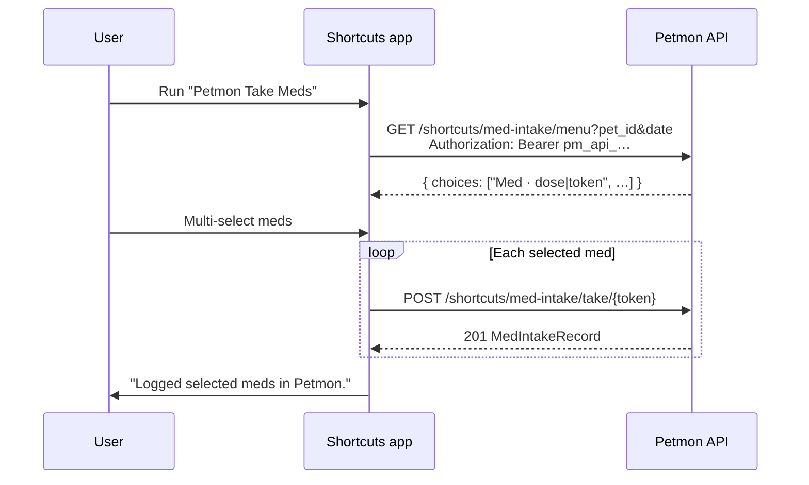

# Apple Shortcut — med intake

Petmon ships a signed **Petmon Take Meds** shortcut for logging daily medications from an iPhone. The shortcut asks for server URL, pet id, and API key on first import, then fetches today’s menu and records takes via the shortcuts API.

See also: [API endpoints](#api-endpoints) · [Server logic](#server-logic) · [Shortcut workflow](#shortcut-workflow-on-device) · [Build & publish](#build-macos)

## Overview



**Distribution:** iPhone import uses an **iCloud share link** (configured in `assets/shortcuts/publish.json` or `MED_INTAKE_SHORTCUT_ICLOUD_URL`). The Health page **Apple Shortcut** button reads `GET /api/v1/info` → `med_intake_shortcut_icloud_url`. Desktop falls back to downloading the signed file from the server.

**Out of scope (for now):** optional meds, bundle members, backdated takes, custom dose overrides.

## Server logic

Implementation: `src/services/shortcut_menu.rs`, handlers in `src/api/shortcuts.rs`.

### Menu (`GET /shortcuts/med-intake/menu`)

1. Load daily assignments for `pet_id` + `date` (same data as `/health/meds/assignments/daily`).
2. **Exclude** assignments marked optional.
3. **Exclude** medications that appear in any bundle for the pet (bundles must be taken via the web UI for now).
4. For each remaining row, build a display label: `{medication name} · {dose_label}`.
5. Encode a **take token** (see below) and return choices as pipe-delimited strings:

```json
{
  "choices": [
    "Benazepril · 1 tab|eyJwZXQ…",
    "Semintra · 1 ml|eyJwZXQ…"
  ]
}
```

Choices are sorted alphabetically by label.

### Take tokens

Opaque URL-safe base64 tokens (no server-side storage). Payload (JSON before encoding):

| Field | Description |
|-------|-------------|
| `pet_id` | UUID string |
| `medication_id` | Medication id |
| `assignment_id` | Assignment id |
| `exp` | Unix expiry (issued at menu fetch + **24 hours**) |

`POST /shortcuts/med-intake/take/{token}` decodes the token, rejects expired/invalid tokens, and calls the same intake path as the web UI (`medication_service::create_intake`) with `source_type: "shortcut"`, `taken: true`, and server-stamped time (real-time dose — no backdating).

Auth: menu requires `api_read`; take requires `api_write` (Bearer API token in the shortcut).

### Shortcut file download

`GET /shortcuts/med-intake.shortcut` serves the embedded signed binary (`assets/shortcuts/petmon-med-intake.shortcut`). **Public** — no auth (listed in auth middleware public paths).

## Shortcut workflow (on device)

Generated by `scripts/build-med-intake-shortcut.py` → `build_workflow()`. Committed signed output is what Docker embeds.

| Step | Action |
|------|--------|
| Import questions | Server URL (default `https://petmon.j0rsa.com`), pet UUID, API key (Write scope) |
| 1 | Read configured Server URL, Pet ID, API Key |
| 2 | Current date → format `yyyy-MM-dd` |
| 3 | `GET {server}/api/v1/shortcuts/med-intake/menu?pet_id=…&date=…` with `Authorization: Bearer {key}` |
| 4 | Parse JSON `choices` array |
| 5 | Multi-select prompt: "Select meds to log" |
| 6 | For each selection: split on `\|`, take token (index 2), `POST {server}/api/v1/shortcuts/med-intake/take/{token}` |
| 7 | Show result: "Logged selected meds in Petmon." |

To change workflow steps, edit `build_workflow()` in the Python script, rebuild on macOS, commit the new `.shortcut`, republish to iCloud, and update `publish.json`.

## API endpoints

| Method | Path | Auth | Purpose |
|--------|------|------|---------|
| `GET` | `/api/v1/shortcuts/med-intake/menu?pet_id=&date=` | `api_read` | Menu choices (`label\|token`) |
| `POST` | `/api/v1/shortcuts/med-intake/take/{token}` | `api_write` | Record take for token |
| `GET` | `/api/v1/shortcuts/med-intake.shortcut` | none | Signed shortcut file |
| `GET` | `/api/v1/info` | none | App version; includes `med_intake_shortcut_icloud_url` when set |

OpenAPI: `/api/docs` → **Shortcuts** tag.

## Build (macOS)

Requires macOS with the Shortcuts CLI (`shortcuts sign`) and Python 3.

```bash
make build-med-intake-shortcut
# or: python3 scripts/build-med-intake-shortcut.py
```

Outputs:

| File | Purpose |
|------|---------|
| `assets/shortcuts/petmon-med-intake.unsigned.plist` | Generated workflow (gitignored) |
| `assets/shortcuts/petmon-med-intake.shortcut` | Signed binary **committed to git** (embedded in the Docker image) |

Linux CI skips signing; the committed signed file from a Mac is used.

## Publish to iCloud (iPhone import)

iOS **does not** import self-hosted `.shortcut` URLs via `shortcuts://import-shortcut`. Use an **iCloud share link** instead.

```bash
make publish-med-intake-shortcut
```

This will:

1. Rebuild/sign the shortcut (macOS)
2. Open it in Shortcuts
3. Print steps to create an iCloud link

After you copy the link from Shortcuts → Share → Share Link:

```bash
python3 scripts/publish-med-intake-shortcut.py --set-url 'https://www.icloud.com/shortcuts/XXXXXXXX'
git add assets/shortcuts/publish.json
git commit -m "chore: update med intake shortcut iCloud link"
```

Redeploy so `GET /api/v1/info` returns the new URL. The Health **Apple Shortcut** button on iPhone uses that link.

### Config

| Source | Precedence |
|--------|------------|
| `MED_INTAKE_SHORTCUT_ICLOUD_URL` env | Highest (container/Helm override) |
| `assets/shortcuts/publish.json` → `icloud_url` | Committed default |

Example `publish.json`:

```json
{
  "icloud_url": "https://www.icloud.com/shortcuts/XXXXXXXX"
}
```

Empty `icloud_url` → button falls back to downloading the self-hosted file (works on desktop; iPhone import may fail until iCloud is configured).

Current production link is stored in `assets/shortcuts/publish.json` (commit updates with the shortcut).

## Updating shortcut logic

1. Edit `scripts/build-med-intake-shortcut.py` (`build_workflow()`).
2. `make build-med-intake-shortcut` on a Mac and commit the new `petmon-med-intake.shortcut`.
3. `make publish-med-intake-shortcut` and update `publish.json` with a **new** iCloud link (old links keep pointing at the previous version).
4. Update this doc if menu rules, tokens, or endpoints change.
