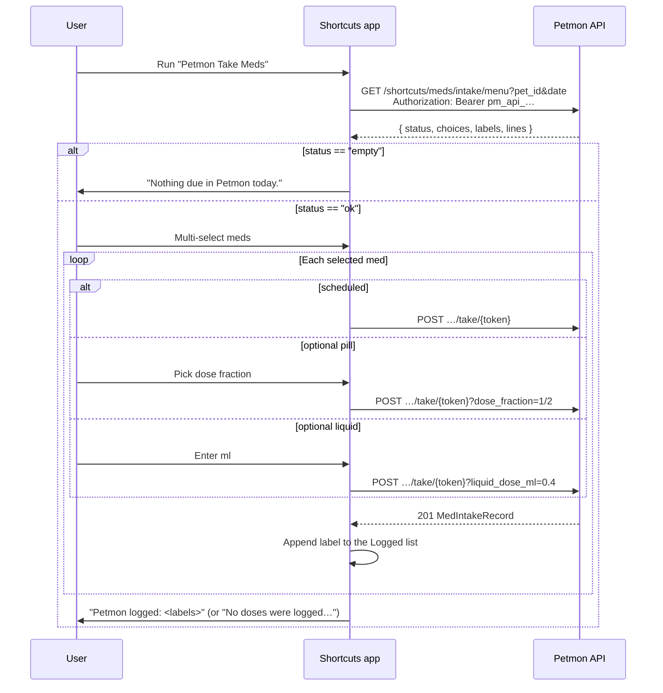

# Apple Shortcut — med intake

Petmon ships a signed **Petmon Take Meds** shortcut for logging daily medications from an iPhone. The shortcut asks for server URL, pet id, and API key on first import, then fetches today’s menu and records takes via the shortcuts API.

See also: [API endpoints](#api-endpoints) · [Server logic](#server-logic) · [Shortcut workflow](#shortcut-workflow-on-device) · [Local testing](#local-testing-no-deployment) · [Build & publish](#build-macos)

## Overview



**Distribution:** iPhone import uses an **iCloud share link** (configured in `assets/shortcuts/publish.json` or `MED_INTAKE_SHORTCUT_ICLOUD_URL`). The Health page **Apple Shortcut** button reads `GET /api/v1/info` → `med_intake_shortcut_icloud_url`. Desktop falls back to downloading the signed file from the server.

Android users: see [`docs/automate-med-intake.md`](automate-med-intake.md) (AutoMate `.flo` download or Community link).

**Out of scope (for now):** bundle members, choosing a dose for a *scheduled* med (the assignment fixes it), and backdating. The shortcut logs the dose as taken **now** and the take endpoint is real-time only — it stamps the server’s clock and accepts no timestamp at all. Backdated doses go through the web UI or `POST /health/meds/intake`.

## Server logic

Implementation: `src/services/shortcut_menu.rs`, handlers in `src/api/shortcuts.rs`.

### Menu (`GET /shortcuts/meds/intake/menu`)

1. Load daily assignments for `pet_id` + `date` (same data as `/health/meds/assignments/daily`).
2. **Include** scheduled meds due on `date` and **optional** (as-needed) meds active on `date`.
3. **Exclude** medications that appear in any bundle for the pet.
4. For each row, build a display label: `{medication name} · {dose_label}`, then **disambiguate duplicates** by appending ` (2)`, ` (3)`, …
5. Encode a **take token** (see below) and return:

```json
{
  "status": "ok",
  "choices": [
    {
      "label": "Benazepril · 1 tab",
      "token": "eyJw…",
      "kind": "scheduled"
    },
    {
      "label": "Gabapentin · As needed",
      "token": "eyJw…",
      "kind": "optional_pill",
      "fractions": ["whole", "three_quarter", "half", "third", "quarter", "eighth", "sixteenth"],
      "fraction_labels": ["1", "3/4", "1/2", "1/3", "1/4", "1/8", "1/16"]
    }
  ],
  "labels": [
    "Benazepril · 1 tab",
    "Gabapentin · As needed"
  ],
  "lines": [
    "Benazepril · 1 tab|eyJw…|scheduled",
    "Gabapentin · As needed|eyJw…|optional_pill|1,3/4,1/2,1/3,1/4,1/8,1/16"
  ]
}
```

The shortcut picker uses `labels`; after selection it matches each chosen label to the parallel `lines` entry, splits on `|`, and reads token, kind, and the optional dose list.

Three contracts the device flows depend on:

| Contract | Why |
|----------|-----|
| `status` is `"ok"` or `"empty"` | Neither Shortcuts nor AutoMate can portably count a list, so “nothing due today” has to be a value they can compare. |
| `labels` are **unique** | The flows carry a label out of the picker and find its line by string equality. Two identical labels would log two doses from one tap. |
| `lines` field 4 uses `fraction_labels` | The dose picker shows that string and sends it straight back as `?dose_fraction=`, so it must be a spelling the API parses. `3/4` and `three_quarter` are both accepted. |

### Take tokens

URL-safe base64 JSON, with no server-side storage.

| Field | Description |
|-------|-------------|
| `pet_id` | UUID string |
| `medication_id` | Medication id |
| `assignment_id` | Assignment id |
| `exp` | Unix expiry (issued at menu fetch + **24 hours**) |

The token is **not signed or encrypted** — treat it as a convenience handle, not an authorization. Every take still needs an `api_write` bearer token, and `repo::med_intake_records::create` re-validates that the medication belongs to the pet, that the assignment belongs to the medication, and that the assignment is active and due on the resulting local date. Do not put anything private in the payload.

### Take (`POST /shortcuts/meds/intake/take/{token}`)

Decodes the token, rejects expired/invalid tokens, and calls the same intake path as the web UI with `source_type: "shortcut"` (or `?source=automate`) and `taken: true`.

| Kind | Query (JSON body alternative) |
|------|-------------------------------|
| `scheduled` | none |
| `optional_pill` | `?dose_fraction=1/2` (or `half`; body `{ "dose_fraction_override": "half" }`) |
| `optional_liquid` | `?liquid_dose_ml=0.4` (body `{ "liquid_dose_ml_override": 0.4 }`) |

**Timing: none.** This endpoint is real-time only. It takes no `occurred_at` / `local_date` — the server stamps its own local time, so the Telegram `#pills` line has no timestamp, exactly like a Take now from the web UI. Backdating deliberately isn’t reachable from a device flow (also worth noting: the take token is unsigned, so a backdating param here would be a backdating primitive for anyone holding one). Use the web UI or `POST /health/meds/intake` for a delayed entry.

Unknown query params are **rejected** with `400`, so an `occurred_at` from a generator that has drifted fails loudly instead of being silently dropped — a dropped one would look like a backdated dose that quietly landed on today. Only `dose_fraction`, `liquid_dose_ml`, their `_override` spellings, and `source` are accepted.

The device’s calendar day still matters for the *menu* (`?date=`), which the shortcut fills from the phone’s clock. If the phone and the server are on different days, the menu is the phone’s day while the record lands on the server’s — the due-date re-validation then rejects it loudly with `400` instead of filing the dose on the wrong day.

Auth: menu requires `api_read`; take requires `api_write` (Bearer API token in the shortcut).

### Shortcut file download

`GET /shortcuts/meds/intake.shortcut` serves the embedded signed binary. **Public** — no auth.

## Shortcut workflow (on device)

Generated by `scripts/med_intake_workflow.py` → `build_workflow()`.

| Step | Action |
|------|--------|
| Import questions | Server URL, pet UUID, API key (Write scope) |
| 1 | Read configured Server URL, Pet ID, API Key |
| 2 | Current date → `yyyy-MM-dd` for the menu (the phone’s own day) |
| 3 | `GET {server}/api/v1/shortcuts/meds/intake/menu?…` |
| 4 | Read `status`, `labels`, `lines` from the response |
| 5 | `status` is `empty` → show “Nothing due in Petmon today.” and stop |
| 6 | Multi-select from `labels`: “Select meds to log” |
| 7 | For each chosen label, loop the `lines`, split on `\|`, compare field 1 with the **selected** label |
| 7a | `optional_pill` → choose from the dose list → `POST …/take/{token}?dose_fraction=…` |
| 7b | `optional_liquid` → ask ml → `POST …/take/{token}?liquid_dose_ml=…` |
| 7c | otherwise (`scheduled`) → `POST …/take/{token}` |
| 8 | After each successful POST, append the label to the **Logged** variable |
| 9 | Show `Logged` — or “No doses were logged…” when it is empty |

Two details that are easy to get wrong and have both broken this shortcut before:

- **Nested loops shadow `Repeat Item`.** Step 7 runs a loop over `lines` *inside* the loop over selected labels, so a bare `Repeat Item` reference resolves to the inner (line) item and the comparison never matches — the shortcut silently logs nothing. Every loop reference is built with `shortcut_plist.repeat_item(<loop group>)`, which emits an action-output reference keyed by that loop’s group UUID. `shortcut_lint` rejects bare `Repeat Item` / `Repeat Index` variable references.
- **Report what was recorded, not what was selected.** The final message reads the `Logged` accumulator, so a run where every POST failed cannot claim success. A non-2xx response aborts the run in Shortcuts, so failures are loud.

After workflow changes: rebuild on macOS, commit `.shortcut`, republish iCloud, update `publish.json`.

## Local testing (no deployment)

Importing a shortcut needs a GUI confirmation on macOS and iOS (`open -g` will not do it), and `shortcuts run` only takes an already-installed shortcut. So the engine itself cannot be driven from CI. Three tiers cover it instead, from cheapest to most faithful.

### Tier 1 — structure + behaviour, no macOS and no server

```bash
make check-shortcut          # part of `make check`
```

- `scripts/shortcut_lint.py` — static checks on the generated plist: token-string placeholders match their attachment offsets, output references resolve to *earlier* actions with the expected name, loop references point at an enclosing loop, control-flow markers nest correctly (`0 → 1* → 2` per `GroupingIdentifier`), HTTP actions carry an `Authorization` header, import questions point at an action that has the parameter they set.
- `scripts/shortcut_sim.py` — a small interpreter for the action subset the shortcut uses. It executes the **same generated plist** against a fake HTTP client and a scripted user, so the tests assert which requests fire, in which order, with which query parameters. It raises on any action it does not implement, so a silently skipped step cannot pass.
- `scripts/tests/test_med_intake_shortcut.py` — the actual expectations: one POST per selected med with its own token, no timestamp param, dose options taken from the server, empty-menu message, nothing-logged message, abort on server error, and regression tests for the two bugs above (a bare `Repeat Item` and unbalanced control flow must fail the linter).

### Tier 2 — real HTTP against a locally running Petmon

```bash
make run-be                                                    # in another terminal
make sim-shortcut ARGS="--pet <uuid> --key <api token> --dry-run"
make sim-shortcut ARGS="--pet <uuid> --key <api token>"
```

Same interpreter, real requests (`scripts/simulate-med-intake-shortcut.py`). This is what catches auth problems, menu-shape drift, and dose parsing. `--dry-run` performs the menu GET but skips the takes; `--select 'Label'` and `--dose 1/2` narrow what it does. Exit status is non-zero when nothing was logged.

### Tier 3 — the real Shortcuts engine (macOS, one manual click)

```bash
make shortcut-engine-test ARGS="--pet <uuid> --key <api token> --server http://localhost:8080"
open "assets/shortcuts/harness/Petmon Take Meds (Test).shortcut"   # click Add Shortcut once
shortcuts run "Petmon Take Meds (Test)"
```

The harness variant has the config baked in and every prompt replaced by a fixed choice (take everything on the menu, first dose option, `--ml` for liquids), so it runs with no taps and returns the logged labels as its output. Use it to confirm that Apple’s engine agrees with the interpreter about action semantics. It embeds an API key, so `assets/shortcuts/harness/` is gitignored.

## API endpoints

| Method | Path | Auth | Purpose |
|--------|------|------|---------|
| `GET` | `/api/v1/shortcuts/meds/intake/menu?pet_id=&date=` | `api_read` | Menu (`status` + `choices` + `labels` + `lines`) |
| `POST` | `/api/v1/shortcuts/meds/intake/take/{token}` | `api_write` | Record take |
| `GET` | `/api/v1/shortcuts/meds/intake.shortcut` | none | Signed shortcut file |
| `GET` | `/api/v1/info` | none | Includes `med_intake_shortcut_icloud_url` when set |

OpenAPI: `/api/docs` → **Shortcuts** tag.

## Generator layout

| File | Role |
|------|------|
| `scripts/shortcut_plist.py` | Plist serialization helpers (token strings, control flow, one function per action). Petmon-free. |
| `scripts/shortcut_lint.py` | Structural validation of a generated workflow. |
| `scripts/shortcut_sim.py` | Interpreter used by the tests and the live simulator. |
| `scripts/med_intake_workflow.py` | The Petmon workflow itself, plus the harness variant. |
| `scripts/build-med-intake-shortcut.py` | CLI: validate, write the plist, sign, build the harness. |
| `scripts/tests/` | `python3 -m unittest discover -s scripts/tests` |

Action UUIDs are derived with `uuid5` from a fixed namespace plus a `LOGIC_VERSION` marker, so the same source always produces byte-identical output. That makes `workflow_sha256` (the sha256 of the XML plist) a meaningful record of *which logic* was published — signing itself is not reproducible.

## Build (macOS)

Requires macOS with the Shortcuts CLI (`shortcuts sign`) and Python 3.

```bash
make build-med-intake-shortcut
# or: python3 scripts/build-med-intake-shortcut.py
python3 scripts/build-med-intake-shortcut.py --validate-only   # no macOS needed
```

Outputs:

| File | Purpose |
|------|---------|
| `assets/shortcuts/Petmon Take Meds.unsigned.plist` | Generated workflow (gitignored) |
| `assets/shortcuts/Petmon Take Meds.shortcut` | Signed binary **committed to git** (embedded in the Docker image) |

Linux CI skips signing; the committed signed file from a Mac is used.

## Publish to iCloud (iPhone import)

iOS **does not** import self-hosted `.shortcut` URLs via `shortcuts://import-shortcut`. Use an **iCloud share link** instead.

```bash
make shortcut
```

Builds/signs the shortcut, opens it in Shortcuts, then prompts for the iCloud share URL and writes `assets/shortcuts/publish.json` (`icloud_url` **and** `workflow_sha256`).

Or step by step:

```bash
make publish-med-intake-shortcut
```

After Shortcuts → Share → Share Link:

```bash
python3 scripts/publish-med-intake-shortcut.py --set-url 'https://www.icloud.com/shortcuts/XXXXXXXX'
git add assets/shortcuts/publish.json
git commit -m "chore: update med intake shortcut iCloud link"
```

Redeploy so `GET /api/v1/info` returns the new URL.

### Config

| Source | Precedence |
|--------|------------|
| `MED_INTAKE_SHORTCUT_ICLOUD_URL` env | Highest |
| `assets/shortcuts/publish.json` → `icloud_url` | Committed default |

## Updating shortcut logic

1. Edit `scripts/med_intake_workflow.py` (`build_workflow()`).
2. `make check-shortcut` — linter plus simulated run.
3. `make sim-shortcut ARGS="--pet <uuid> --key <token>"` against a local server.
4. `make shortcut` on a Mac and commit the new `Petmon Take Meds.shortcut`.
5. Share a **new** iCloud link and record it with `--set-url`, which also stores the new `workflow_sha256`.

`make check-shortcut-publish` fails while `publish.json`’s digest differs from the committed workflow — that state means iPhone users are still importing the old logic. It is deliberately **not** part of `make check`, because clearing it requires the manual Apple share flow.
