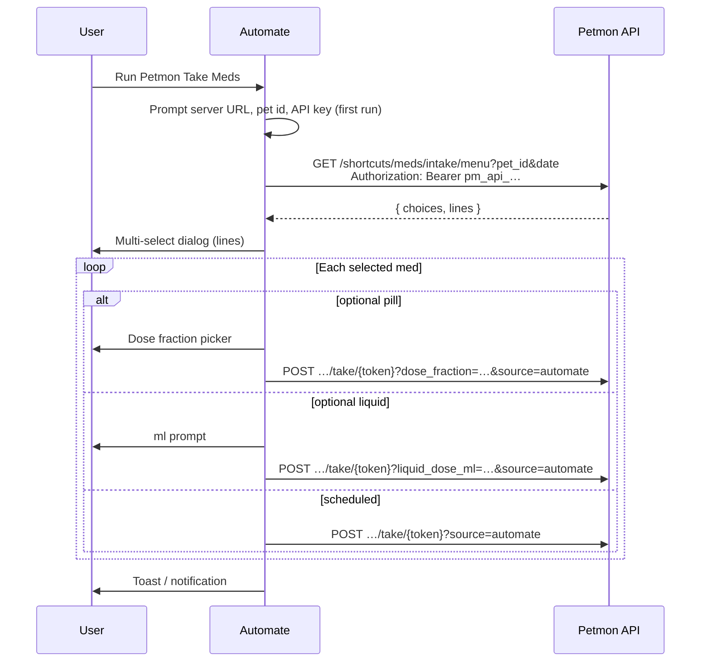

# AutoMate med intake flow

Petmon ships a **Petmon Take Meds** [AutoMate](https://llamalab.com/automate/) flow for logging daily medications from Android. It uses the same shortcuts API as the Apple Shortcut: fetch today’s menu, multi-select meds, record takes via opaque tokens.

See also: [API endpoints](#api-endpoints) · [Flow workflow](#flow-workflow-on-device) · [Build & publish](#build--publish)

## Overview



**Distribution:** Android can import a `.flo` file directly (unlike iOS Shortcuts). The Health page **AutoMate** button reads `GET /api/v1/info` → `med_intake_automate_community_url` when set, otherwise downloads `GET /api/v1/shortcuts/meds/intake.flo`.

## API endpoints

Same as the Apple Shortcut — see [`docs/apple-shortcut-med-intake.md`](apple-shortcut-med-intake.md).

| Method | Path | Auth | Notes |
|--------|------|------|-------|
| `GET` | `/api/v1/shortcuts/meds/intake/menu?pet_id=&date=` | `api_read` | Menu (`choices` + `lines`) |
| `POST` | `/api/v1/shortcuts/meds/intake/take/{token}` | `api_write` | Record take; add `?source=automate` for intake source |
| `GET` | `/api/v1/shortcuts/meds/intake.flo` | none | AutoMate flow file |
| `GET` | `/api/v1/info` | none | Includes `med_intake_automate_community_url` when set |

### Take query parameters

| Param | Purpose |
|-------|---------|
| `dose_fraction` | Optional pill fraction (`whole`, `half`, …) |
| `liquid_dose_ml` | Optional liquid dose in ml |
| `source` | Intake source label; use `automate` from the flow |

## Flow workflow on device

1. Install [Automate](https://play.google.com/store/apps/details?id=com.llamalab.automate) (free tier is enough).
2. Import **Petmon Take Meds** from the Health page (`.flo` download) or Automate Community link.
3. On first run, enter:
   - **Server URL** — e.g. `https://petmon.j0rsa.com` (include `https://`)
   - **Pet ID** — UUID from Petmon → Settings → Developer mode
   - **API key** — `pm_api_…` token with **Read** + **Write** scope
4. Run the flow → pick meds → takes are logged in Petmon.

## Building the flow in AutoMate

AutoMate flows use a proprietary `.flo` binary format; there is no programmatic builder in this repo yet. Build the flow in the app, then export it to `assets/automate/Petmon Take Meds.flo`.

### Block outline

Configure three flow variables (or Dialog input blocks on first run):

| Variable | Example |
|----------|---------|
| `serverUrl` | `https://petmon.j0rsa.com` |
| `petId` | pet UUID |
| `apiKey` | `pm_api_…` |

Then wire blocks in order:

1. **Flow beginning** — title `Petmon Take Meds`
2. **Time** → format as `yyyy-MM-dd` → `todayDate`
3. **HTTP request** (GET)  
   - URL: `{serverUrl}/api/v1/shortcuts/meds/intake/menu?pet_id={petId}&date={todayDate}`  
   - Headers: `{ "Authorization": "Bearer {apiKey}" }`  
   - Save response → `menuJson`
4. **Expression** — `jsonDecode(menuJson)["lines"]` → `menuLines`
5. **Dialog choice** — input `menuLines`, allow multiple selection → `pickedLines`
6. **For each** `pickedLines` → `line`
7. **Expression** — `split(line, "|")[2]` → `token` (index 1 = label, 2 = token, 3 = kind)
8. **Expression decision** on `split(line, "|")[3]`:
   - **`optional_pill`** → Dialog choice on fractions from `split(line, "|")[4]` (comma-separated) → HTTP POST with `?dose_fraction={pick}&source=automate`
   - **`optional_liquid`** → Dialog input (number) for ml → HTTP POST with `?liquid_dose_ml={ml}&source=automate`
   - **else (scheduled)** → HTTP POST `{serverUrl}/api/v1/shortcuts/meds/intake/take/{token}?source=automate`
9. **Toast** — “Logged selected meds in Petmon.”

Each **HTTP request** (POST) uses `Authorization: Bearer {apiKey}` and method POST with empty body.

### Export

1. In AutoMate: long-press the flow → **Export** / share to storage.
2. Copy the `.flo` file to `assets/automate/Petmon Take Meds.flo` in this repo.
3. Validate: `python3 scripts/build-med-intake-automate.py --check`
4. Commit the file and redeploy.

The committed bootstrap file (from `make build-med-intake-automate`) is a placeholder until you export the real flow.

## Build & publish

### Bootstrap placeholder flo

```bash
make build-med-intake-automate
# or: python3 scripts/build-med-intake-automate.py --bootstrap
```

Downloads a community template, retitles it, and writes `assets/automate/Petmon Take Meds.flo`. **Replace** with your exported flow before shipping.

### Automate Community (optional)

Like iCloud for Shortcuts, you can upload the flow to [Automate Community](https://llamalab.com/automate/community/) and store the link:

```bash
make automate
# or: python3 scripts/publish-med-intake-automate.py --await-url
```

Or set the URL directly:

```bash
python3 scripts/publish-med-intake-automate.py --set-url 'https://llamalab.com/automate/community/flows/12345'
git add assets/shortcuts/publish.json
```

| Config | Location |
|--------|----------|
| `automate_community_url` | `assets/shortcuts/publish.json` |
| Override | `MED_INTAKE_AUTOMATE_COMMUNITY_URL` env |

## Updating flow logic

1. Edit the flow in AutoMate (block outline above).
2. Export to `assets/automate/Petmon Take Meds.flo` and commit.
3. Re-upload to Automate Community if used; run `make automate` to update `publish.json`.
